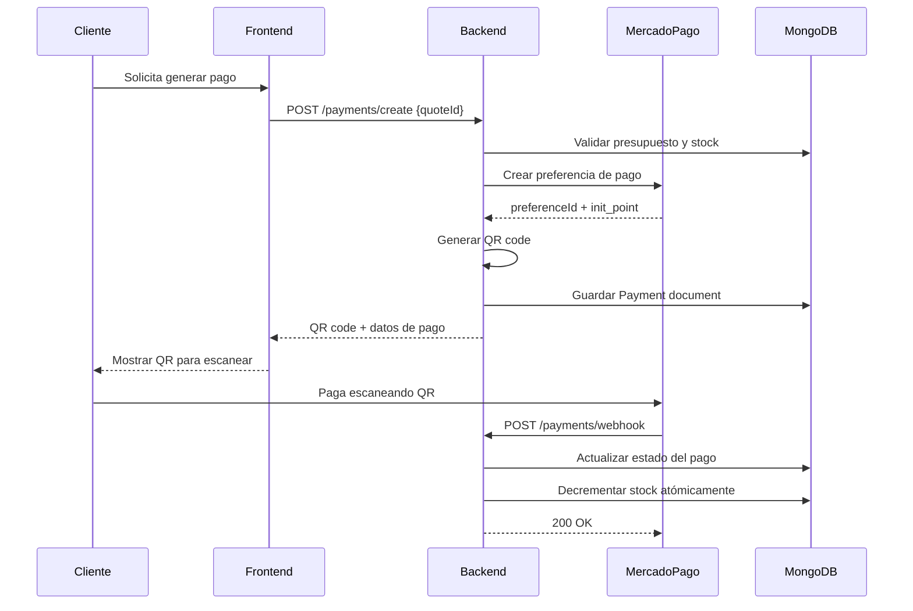

# 💳 Integración MercadoPago - Documentación Técnica

## 📋 Resumen de la Implementación

Esta documentación describe la integración completa con MercadoPago para el sistema de presupuestos, incluyendo generación de QR codes, procesamiento de webhooks y manejo automático de stock.

## 🏗️ Arquitectura de la Integración

### Flujo Completo de Pago



## 🛠️ Componentes Implementados

### 1. Configuración MercadoPago (`src/config/mercadopago.ts`)

**Características:**
- ✅ Configuración singleton del SDK
- ✅ Validación de tokens TEST/PROD
- ✅ Detección automática del entorno
- ✅ Validación completa de configuración

**Uso:**
```typescript
import { getMercadoPagoConfig } from '../config/mercadopago';

const config = getMercadoPagoConfig();
const environment = config.getEnvironment(); // 'sandbox' | 'production'
```

### 2. Servicio MercadoPago (`src/services/mercadopago.service.ts`)

**Funciones principales:**

#### `createPaymentOrder(params)`
- Crea preferencia en MercadoPago
- Genera QR code en base64
- Configura URLs de callback y webhook
- Establece expiración automática

#### `processWebhook(data, signature)`
- Valida firma del webhook
- Procesa diferentes tipos de notificación
- Consulta estado actualizado desde MP
- Retorna datos procesados

#### `getPaymentStatus(paymentId)`
- Consulta estado actual de un pago
- Útil para polling desde frontend

### 3. Servicio de Stock (`src/services/stock.service.ts`)

**Operaciones atómicas:**

#### `validateStock(items)`
- Valida disponibilidad antes de crear orden
- Retorna errores específicos por producto

#### `decrementStock(items)`
- Operación atómica con MongoDB transactions
- Rollback automático en caso de error
- Logging detallado de cambios

#### `incrementStock(items)`
- Para cancelaciones o reversiones
- También con transacciones atómicas

### 4. Controlador de Pagos Actualizado (`src/controllers/paymentController.ts`)

**Endpoints implementados:**

#### `POST /payments/create`
```typescript
// Request
{
  "quoteId": "64f5b4a7c8d9e1f2a3b4c5d6"
}

// Response
{
  "success": true,
  "data": {
    "paymentId": "64f5b4a7c8d9e1f2a3b4c5d7",
    "preferenceId": "MP_PREFERENCE_ID",
    "qrCode": "data:image/png;base64,iVBORw0KGgo...",
    "qrCodeData": "https://www.mercadopago.com.ar/checkout/v1/redirect?pref_id=...",
    "initPoint": "https://www.mercadopago.com.ar/checkout/v1/redirect?pref_id=...",
    "amount": 15000,
    "expiresAt": "2024-01-16T10:30:00.000Z"
  }
}
```

#### `POST /payments/webhook`
- Recibe notificaciones de MercadoPago
- Procesa cambios de estado
- Actualiza stock automáticamente
- Siempre responde 200 OK

#### `GET /payments/:paymentId/status`
- Consulta estado actual del pago
- Útil para polling desde frontend
- Incluye información del presupuesto

## 🔄 Estados de Pago y Transiciones

### Estados Posibles

| Estado | Descripción | Acciones |
|--------|-------------|----------|
| `pending` | Pago creado, esperando | QR generado, stock validado |
| `approved` | Pago aprobado | Stock decrementado, presupuesto marcado como pagado |
| `rejected` | Pago rechazado | Presupuesto sigue disponible |
| `cancelled` | Pago cancelado | Presupuesto vuelve a estar disponible |

### Transiciones Automáticas

```typescript
// Webhook received: payment.updated
switch (status) {
  case 'approved':
    // 1. Actualizar Payment.status = 'approved'
    // 2. Actualizar Quote.status = 'paid'
    // 3. Decrementar stock atómicamente
    // 4. Registrar Payment.paidAt
    break;

  case 'rejected':
    // 1. Actualizar Payment.status = 'rejected'
    // 2. Quote sigue en 'pending' para nuevo intento
    break;

  case 'cancelled':
    // 1. Actualizar Payment.status = 'cancelled'
    // 2. Liberar Quote.paymentId
    break;
}
```

## 🔐 Seguridad Implementada

### Validaciones
- ✅ Validación de firma de webhooks
- ✅ Verificación de origen de requests
- ✅ Validación de tokens de MercadoPago
- ✅ Sanitización de datos de entrada

### Protecciones
- ✅ Rate limiting en endpoints sensibles
- ✅ Autenticación JWT requerida
- ✅ Logging de todas las transacciones
- ✅ No exposición de tokens en logs

## 🧪 Testing y Desarrollo

### Credenciales de TEST

```bash
# Tokens de prueba (incluir en .env)
MERCADOPAGO_ACCESS_TOKEN=TEST-4389086729399925-110910-5e2e02e1b5fc04e9aef67e86ba5a0abe-1265043745
MERCADOPAGO_PUBLIC_KEY=TEST-0b9ba0fd-1234-4567-8910-abcdef123456
```

### Tarjetas de Prueba

| Número | Resultado | Código de Seguridad | Fecha |
|--------|-----------|-------------------|-------|
| 4509 9535 6623 3704 | Aprobado | 123 | 11/25 |
| 5031 7557 3453 0604 | Aprobado | 123 | 11/25 |
| 4774 0518 4064 5612 | Rechazado | 123 | 11/25 |

### Webhook Testing

```bash
# Para testing local con ngrok
ngrok http 3000

# Actualizar webhook URL en MercadoPago
MERCADOPAGO_WEBHOOK_URL=https://abc123.ngrok.io/api/payments/webhook
```

### Test Manual del Flujo

```bash
# 1. Crear usuario admin
curl -X POST http://localhost:3000/api/auth/register \
  -H "Content-Type: application/json" \
  -d '{
    "email": "admin@test.com",
    "password": "Password123",
    "name": "Test Admin",
    "role": "admin"
  }'

# 2. Login y obtener token
curl -X POST http://localhost:3000/api/auth/login \
  -H "Content-Type: application/json" \
  -d '{
    "email": "admin@test.com",
    "password": "Password123"
  }'

# 3. Crear producto
curl -X POST http://localhost:3000/api/products \
  -H "Content-Type: application/json" \
  -H "Authorization: Bearer YOUR_TOKEN" \
  -d '{
    "name": "Producto Test",
    "description": "Para testing de pagos",
    "price": 100,
    "stock": 50,
    "category": "Test"
  }'

# 4. Crear presupuesto
curl -X POST http://localhost:3000/api/quotes \
  -H "Content-Type: application/json" \
  -H "Authorization: Bearer YOUR_TOKEN" \
  -d '{
    "customer": {
      "name": "Cliente Test",
      "email": "cliente@test.com"
    },
    "items": [{
      "productId": "PRODUCT_ID_FROM_STEP_3",
      "quantity": 2
    }]
  }'

# 5. Crear pago
curl -X POST http://localhost:3000/api/payments/create \
  -H "Content-Type: application/json" \
  -H "Authorization: Bearer YOUR_TOKEN" \
  -d '{
    "quoteId": "QUOTE_ID_FROM_STEP_4"
  }'

# 6. Consultar estado
curl -X GET http://localhost:3000/api/payments/PAYMENT_ID/status \
  -H "Authorization: Bearer YOUR_TOKEN"
```

## 📊 Monitoring y Logs

### Logs Importantes

```typescript
// Logs de creación de pago
logger.info('Pago creado exitosamente', {
  paymentId: payment._id,
  preferenceId: mercadoPagoResult.preferenceId,
  quoteNumber: quote.quoteNumber,
  amount: quote.total
});

// Logs de webhook
logger.info('Webhook recibido de MercadoPago', {
  action: webhookData.action,
  type: webhookData.type,
  dataId: webhookData.data?.id,
  hasSignature: !!signature
});

// Logs de stock
logger.info('Stock decrementado exitosamente', {
  paymentId: payment._id,
  quoteId: quote._id,
  productsUpdated: stockResult.updatedProducts?.length
});
```

### Métricas a Monitorear

1. **Tasa de conversión de pagos**
   - Pagos creados vs pagos aprobados
   - Tiempo promedio hasta aprobación

2. **Errores de stock**
   - Frecuencia de stock insuficiente
   - Errores en transacciones atómicas

3. **Webhooks**
   - Tiempo de respuesta
   - Webhooks fallidos o duplicados

4. **Performance**
   - Tiempo de generación de QR
   - Latencia de respuesta de MercadoPago

## 🚨 Troubleshooting

### Errores Comunes

#### Error: "MERCADOPAGO_ACCESS_TOKEN no está configurado"
```bash
# Solución: Verificar .env
echo $MERCADOPAGO_ACCESS_TOKEN
# Debe empezar con TEST- o APP-
```

#### Error: "Stock insuficiente después de webhook"
```bash
# Posible causa: Race condition en webhook duplicado
# Solución: Verificar idempotencia en handlePaymentWebhook
```

#### Error: "Webhook con firma inválida"
```bash
# Revisar configuración de x-signature
# Verificar que la URL del webhook es accesible desde internet
```

### Health Check de MercadoPago

```bash
# Endpoint para verificar conectividad
curl -X GET http://localhost:3000/api/payments/health \
  -H "Authorization: Bearer YOUR_TOKEN"
```

## 🔄 Roadmap de Mejoras

### Próximas Implementaciones

1. **Instalments/Cuotas**
   - Configuración de cuotas sin interés
   - Cuotas con interés

2. **Suscripciones**
   - Pagos recurrentes
   - Planes de suscripción

3. **Marketplace**
   - Split de pagos
   - Comisiones automáticas

4. **Analytics**
   - Dashboard de pagos
   - Reportes de conversión

5. **Notificaciones**
   - Email al cliente en pago aprobado
   - SMS de confirmación
   - Webhooks a sistemas externos

## 📞 Soporte

Para problemas específicos de MercadoPago:
- [Documentación oficial](https://www.mercadopago.com.ar/developers)
- [SDKs y herramientas](https://github.com/mercadopago)
- [Status page](https://status.mercadopago.com/)

---

**¡La integración está completa y lista para producción!** 🎉